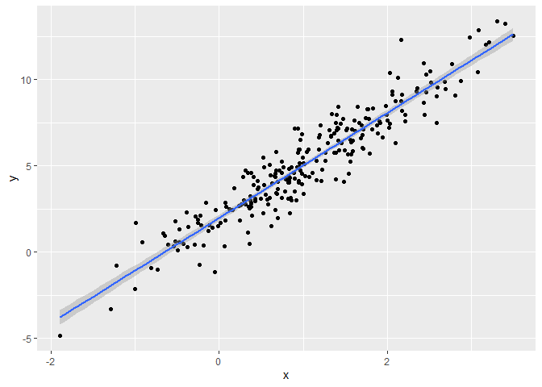
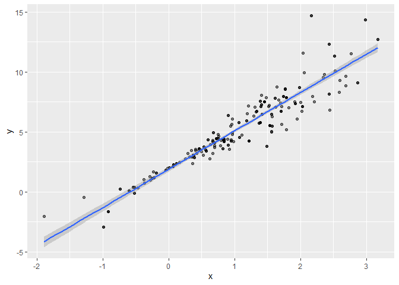
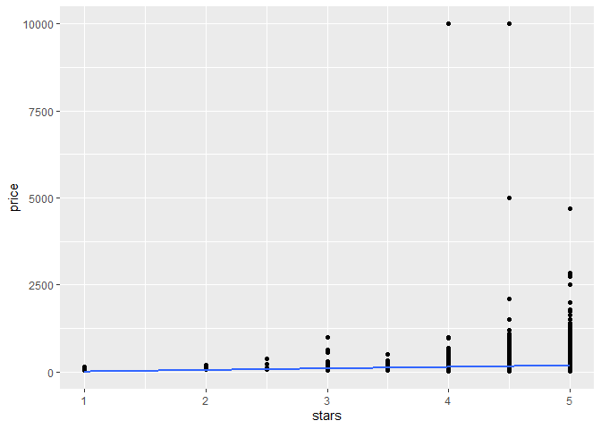
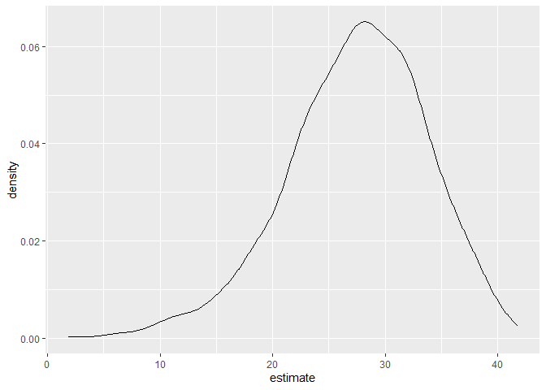

Bootstrapping
================
Mari Sanders
2024-11-14

Loading Packages

Bootstrapping

Make up some data

``` r
n_samp <- 250 

sim_df_constant <- 
  tibble(
    x = rnorm(n_samp, 1, 1),
    error = rnorm(n_samp, 0,1),
    y = 2 + 3*x + error
  )

sim_df_nonconstant <- 
  sim_df_constant %>% 
  mutate(
  error = error * 0.75 * x, 
  y = 2+ 3*x + error
  )
```

``` r
sim_df_constant %>% ggplot(aes(x = x, y = y)) + 
  geom_point() + 
  stat_smooth(method = "lm")
```

    ## `geom_smooth()` using formula = 'y ~ x'

<!-- -->

``` r
sim_df_nonconstant %>% ggplot(aes(x = x, y = y)) + 
  geom_point() + 
  stat_smooth(method = "lm")
```

    ## `geom_smooth()` using formula = 'y ~ x'

<!-- -->

Look at regression results

``` r
sim_df_constant %>% 
  lm(y~x, data = .) %>% 
  broom::tidy() %>% 
  knitr::kable(digits = 3)
```

| term        | estimate | std.error | statistic | p.value |
|:------------|---------:|----------:|----------:|--------:|
| (Intercept) |    1.977 |     0.098 |    20.157 |       0 |
| x           |    3.045 |     0.070 |    43.537 |       0 |

``` r
sim_df_nonconstant %>% 
  lm(y~x, data = .) %>% 
  broom::tidy() %>% 
  knitr::kable(digits = 3)
```

| term        | estimate | std.error | statistic | p.value |
|:------------|---------:|----------:|----------:|--------:|
| (Intercept) |    1.934 |     0.105 |    18.456 |       0 |
| x           |    3.112 |     0.075 |    41.661 |       0 |

# Draw a bootstrap sample

- Need to be the same size as the original

``` r
boot_sample <- function(df) {
  
  boot_df <- 
    sample_frac(df, replace = TRUE) %>% 
    arrange(x)
  
  return(boot_df)
}
```

Try running this

``` r
sim_df_nonconstant %>% 
  boot_sample() %>% 
  ggplot(aes(x = x, y = y)) + 
  geom_point(alpha = 0.5) + 
  stat_smooth(method = "lm")
```

    ## `geom_smooth()` using formula = 'y ~ x'

<!-- -->

Doing this as part of an analysis

``` r
sim_df_nonconstant %>% 
  boot_sample() %>% lm(y~x, data =.)
```

    ## 
    ## Call:
    ## lm(formula = y ~ x, data = .)
    ## 
    ## Coefficients:
    ## (Intercept)            x  
    ##       1.896        3.142

# Repeat

``` r
boot_straps <- 
  tibble(
    strap_number = 1:1000
  ) %>% 
  mutate(
    strap_sample = map(strap_number, \(i) boot_sample(df = sim_df_nonconstant)), 
    models = map(strap_sample, \(df) lm(y~x, data = df)), 
    results = map(models, broom::tidy)
  )

bootstrap_results <- 
  boot_straps %>% 
  select(strap_number, results) %>% 
  unnest(results) %>% 
  group_by(term) %>% 
  summarize(
    boot_se = sd(estimate)
  ) %>% 
  knitr::kable(digits = 3)
```

``` r
boot_straps <- 
  tibble(
    strap_number = 1:1000
  ) %>% 
  mutate(
    strap_sample = map(strap_number, \(i) boot_sample(df = sim_df_constant)), 
    models = map(strap_sample, \(df) lm(y~x, data = df)), 
    results = map(models, broom::tidy)
  )

bootstrap_results <- 
  boot_straps %>% 
  select(strap_number, results) %>% 
  unnest(results) %>% 
  group_by(term) %>% 
  summarize(
    boot_se = sd(estimate)
  ) %>% 
  knitr::kable(digits = 3)
```

## Bootstrap with modelr

``` r
boot_straps <- 
  sim_df_constant %>% 
  modelr::bootstrap(1000) %>% 
  mutate(
    strap = map(strap, as_tibble), 
    models = map(strap, \(df) lm(y~x, data = df)), 
    results = map(models, broom::tidy)
  ) %>% 
  select(.id, results) %>% 
  unnest(results) 
```

# What do you report?

``` r
boot_straps %>% 
  group_by(term) %>% 
  summarize(
    boot_est = mean(estimate),
    boot_se = sd(estimate), 
    boot_ci_ll = quantile(estimate, 0.025), 
    boot_ci_ul = quantile(estimate, 0.975)
  )
```

    ## # A tibble: 2 × 5
    ##   term        boot_est boot_se boot_ci_ll boot_ci_ul
    ##   <chr>          <dbl>   <dbl>      <dbl>      <dbl>
    ## 1 (Intercept)     1.98  0.0985       1.78       2.18
    ## 2 x               3.04  0.0699       2.91       3.18

- estimates, confidence intervals

## Airbnb

``` r
data("nyc_airbnb")

manhattan_df <- 
  nyc_airbnb %>%  
  mutate(stars = review_scores_location / 2) %>%  
  rename(
    borough = neighbourhood_group,
    neighborhood = neighbourhood) %>% 
  filter(borough == "Manhattan") %>%  
  drop_na() %>%  
  select(price, stars, room_type)
```

plot data

``` r
manhattan_df %>% 
  ggplot(aes(x = stars, y = price)) + 
  geom_point() + 
  stat_smooth(method = "lm", se = FALSE)
```

    ## `geom_smooth()` using formula = 'y ~ x'

<!-- -->

fit linear model

``` r
manhattan_df %>% 
  lm(price ~ stars + room_type, data = .) %>% 
  broom::tidy()
```

    ## # A tibble: 4 × 5
    ##   term                  estimate std.error statistic   p.value
    ##   <chr>                    <dbl>     <dbl>     <dbl>     <dbl>
    ## 1 (Intercept)               95.0     22.3       4.26 2.04e-  5
    ## 2 stars                     27.3      4.60      5.93 3.04e-  9
    ## 3 room_typePrivate room   -124.       3.48    -35.7  4.76e-268
    ## 4 room_typeShared room    -154.      10.1     -15.2  1.03e- 51

Bootstrap

``` r
boot_results <- 
  manhattan_df %>% 
  modelr::bootstrap(1000) %>% 
  mutate(
    strap = map(strap, as_tibble), 
    models = map(strap, \(df) lm(price ~ stars + room_type, data = df)), 
    results = map(models, broom::tidy)
  ) %>% 
  select(.id, results) %>% 
  unnest(results) 
boot_results %>% 
  filter(term == "stars") %>% 
  ggplot(aes(estimate)) + 
  geom_density()
```

<!-- -->

``` r
boot_results %>% 
  group_by(term) %>% 
  summarize(
    boot_est = mean(estimate),
    boot_se = sd(estimate), 
    boot_ci_ll = quantile(estimate, 0.025), 
    boot_ci_ul = quantile(estimate, 0.975)
  )
```

    ## # A tibble: 4 × 5
    ##   term                  boot_est boot_se boot_ci_ll boot_ci_ul
    ##   <chr>                    <dbl>   <dbl>      <dbl>      <dbl>
    ## 1 (Intercept)               94.3   30.6        41.7      163. 
    ## 2 room_typePrivate room   -125.     3.27     -131.      -118. 
    ## 3 room_typeShared room    -154.     2.96     -160.      -148. 
    ## 4 stars                     27.5    6.21       13.8       38.3
