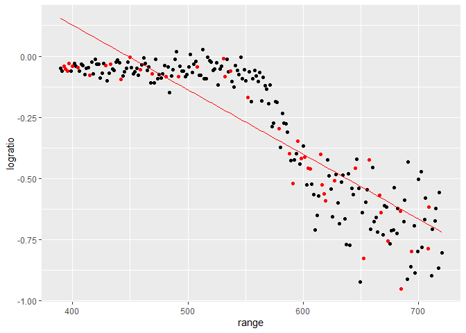
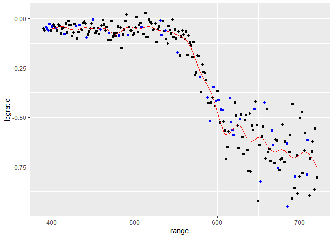
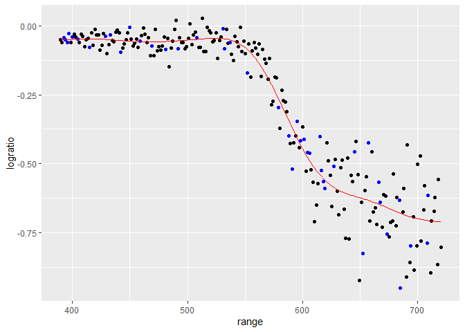
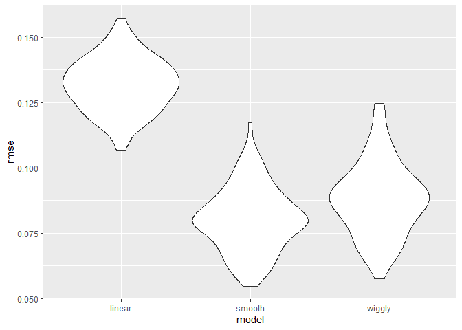
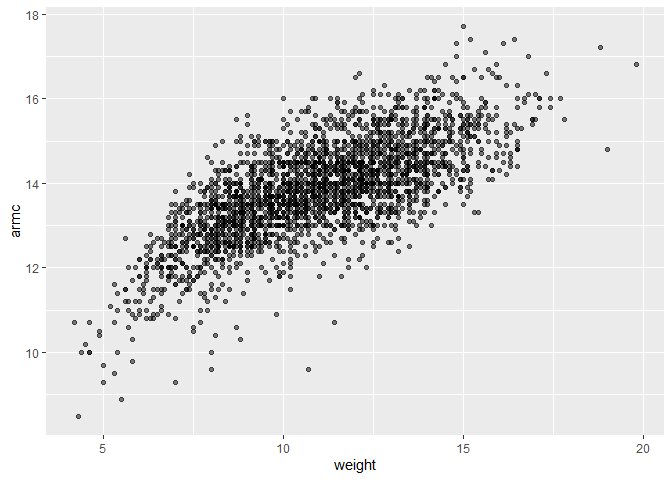
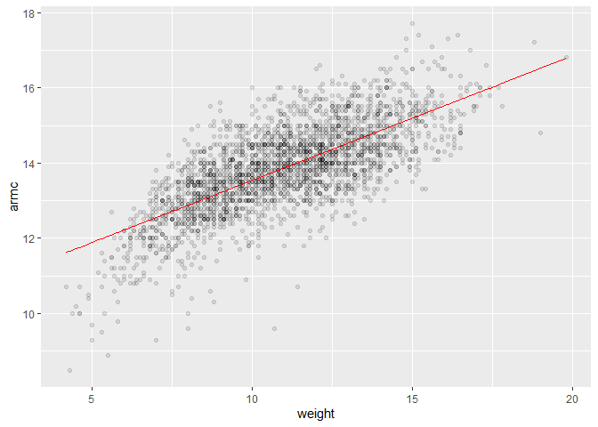
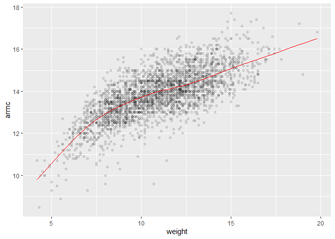
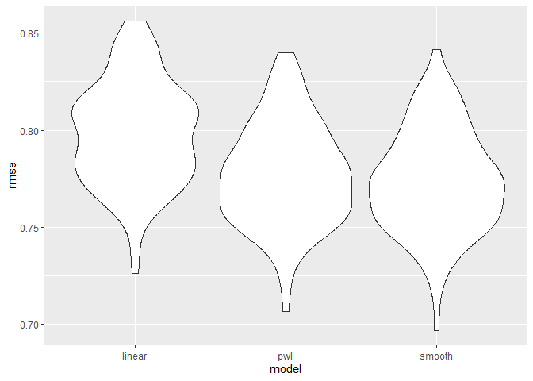

Cross Validation”
================
Mari Sanders
2024-11-12

# LIDAR Data

``` r
data("lidar")

lidar_df <- 
  lidar %>% 
  as_tibble() %>% 
  mutate(id = row_number())
```

``` r
lidar_df %>% 
  ggplot(aes(x = range, y = logratio)) + 
  geom_point()
```

<!-- -->

# Cross Validation

- Compare 3 models, one linear, one smooth, one wiggly

Construct training and testing df

``` r
train_df <- sample_frac(lidar_df, size = 0.8)
test_df <- anti_join(lidar_df, train_df, by = "id")
```

``` r
ggplot(train_df, aes(x = range, y = logratio)) + 
  geom_point() + geom_point(data = test_df, color = "red")
```

<!-- -->

Fit three models

``` r
linear_mod <- lm(logratio ~ range, data = train_df)
smooth_mod <- gam(logratio ~ s(range), data = train_df)
wiggly_mod <- gam(logratio ~ s(range, k = 30), sp = 10e-6, data = train_df)
```

Look at fits

``` r
train_df %>% 
  add_predictions(linear_mod) %>% 
  ggplot(aes(x = range, y = logratio)) +
  geom_point() + 
  geom_point(data = test_df, color = "red") +
  geom_line(aes(y = pred), color = "red")
```

<!-- -->

``` r
train_df %>% 
  add_predictions(wiggly_mod) %>% 
  ggplot(aes(x = range, y = logratio)) +
  geom_point() +  
  geom_point(data = test_df, color = "blue") +
  geom_line(aes(y = pred), color = "red")
```

<!-- -->

``` r
train_df %>% 
  add_predictions(smooth_mod) %>% 
  ggplot(aes(x = range, y = logratio)) +
  geom_point() +  geom_point(data = test_df, color = "blue") +
  geom_line(aes(y = pred), color = "red")
```

<!-- -->

- Does better than linear model because it is capturing the trends, but
  not trying to be so flexible like `wiggly_mod`

Compare these numerically using rmse

``` r
rmse(linear_mod, test_df)
```

    ## [1] 0.127317

``` r
rmse(smooth_mod, test_df)
```

    ## [1] 0.08302008

``` r
rmse(wiggly_mod, test_df)
```

    ## [1] 0.08848557

# Repeat the train/test split

``` r
cv_df <- 
  crossv_mc(lidar_df, 100) %>% 
  mutate(
    train = map(train, as_tibble), 
    test = map(test, as_tibble)
  )
```

Fit models, extract RMSEs

``` r
cv_res_df <- 
  cv_df %>% 
  mutate(
    linear_mod = map(train, \(x) lm(logratio ~range, data = x)),
    smooth_mod = map(train, \(x) gam(logratio ~s(range), data = x)),
    wiggly_mod = map(train, \(x) gam(logratio ~s(range, k = 30), sp = 10e-6, data = x))
  ) %>% 
  mutate(
    rmse_linear = map2_dbl(linear_mod, test, rmse),
    rmse_smooth = map2_dbl(smooth_mod, test, rmse),
    rmse_wiggly = map2_dbl(wiggly_mod, test, rmse)
  ) 
```

Look at RMSE distribution

``` r
cv_res_df %>% 
  select(starts_with("rmse")) %>% 
  pivot_longer(
    everything(), 
    names_to = "model", 
    values_to = "rmse",
    names_prefix = "rmse_"
  ) %>% 
  ggplot(aes(x = model, y = rmse)) + 
  geom_violin()
```

<!-- -->

# Nepalese Children Dataframe

``` r
child_df <- read_csv("data/nepalese_children.csv") %>% 
  mutate(
    weight_ch7 = (weight > 7) * (weight - 7)
  ) 
```

    ## Rows: 2705 Columns: 5
    ## ── Column specification ────────────────────────────────────────────────────────
    ## Delimiter: ","
    ## dbl (5): age, sex, weight, height, armc
    ## 
    ## ℹ Use `spec()` to retrieve the full column specification for this data.
    ## ℹ Specify the column types or set `show_col_types = FALSE` to quiet this message.

Look at df

``` r
child_df %>% 
  ggplot(aes(x = weight, y = armc)) + 
  geom_point(alpha = 0.5)
```

<!-- -->

Fit Models

``` r
linear_mod = lm(armc ~weight, data = child_df)
pwl_mod = lm(armc ~weight + weight_ch7, data = child_df)
smooth_mod <- gam(armc ~s(weight), data = child_df)
```

Look at models

``` r
child_df %>% 
  add_predictions(linear_mod) %>% 
  ggplot(aes(x = weight, y = armc)) + 
  geom_point(alpha = 0.1) + 
  geom_line(aes(y = pred), color = "red")
```

<!-- -->

``` r
child_df %>% 
  add_predictions(pwl_mod) %>% 
  ggplot(aes(x = weight, y = armc)) + 
  geom_point(alpha = 0.1) + 
  geom_line(aes(y = pred), color = "red")
```

<!-- -->

``` r
child_df %>% 
  add_predictions(smooth_mod) %>% 
  ggplot(aes(x = weight, y = armc)) + 
  geom_point(alpha = 0.1) + 
  geom_line(aes(y = pred), color = "red")
```

<!-- -->

CV to select models

``` r
cv_df <- 
  crossv_mc(child_df, 100) %>% 
  mutate(
    train = map(train, as_tibble), 
    test = map(test, as_tibble)
  )
```

Apply models and extract RMSE

``` r
cv_res_df <- 
  cv_df %>% 
  mutate(
    linear_mod = map(train, \(x) lm(armc ~ weight, data = x)), 
    pwl_mod = map(train, \(x) lm(armc ~ weight + weight_ch7, data = x)), 
    smooth_mod = map(train, \(x) gam(armc ~ s(weight), data = x)) 
  ) %>% 
  mutate(
    rmse_linear = map2_dbl(linear_mod, test, rmse),
    rmse_pwl = map2_dbl(pwl_mod, test, rmse), 
    rmse_smooth = map2_dbl(smooth_mod, test, rmse)
  )
```

``` r
cv_res_df %>% 
  select(starts_with("rmse")) %>% 
  pivot_longer(
    everything(), 
    names_to = "model", 
    values_to = "rmse",
    names_prefix = "rmse_"
  ) %>% 
  ggplot(aes(x = model, y = rmse)) + 
  geom_violin()
```

<!-- -->
